## Table of Contents
- [Overview](#overview)  
  - [About Campus Beats](#about-campus-beats)
  - [What does Campus Beats Do?](#what-does-campus-beats-do)
  - [How does Campus Beats Work?](#how-does-campus-beats-work)
- [User Guide to using Campus Beats x](#user-guide-to-using-campus-beats)
  - [Average User Experience](#average-user-experience)
    - [Landing Page and Login](#landing-page-and-login)
    - [Edit Profile](#edit-profile)
    - [Home Page](#home-page)
    - [Beats Page](#beats-page)
    - [Calendar Page](#calendar-page)
  - [Admin Experience](#admin-experience)
- [Developer Guide to Campus Beats](#developer-guide-to-campus-beats)
  - [Installation](#installation)
  - [Running the Application](#running-the-application)
  - [Modifications x](#modifications)
- [Application Design](#application-design)
  - [Directory structure](#directory-structure)
  - [Import conventions](#import-conventions)
  - [Naming conventions](#naming-conventions)
  - [Data model](#data-model)
  - [CSS](#css)
  - [Routing](#routing)
  - [Authentication](#authentication)
  - [Authorization](#authorization)
  - [Configuration](#configuration)
  - [Quality Assurance](#quality-assurance)
    - [ESLint](#eslint)
- [Development History](#development-history)
  - [Initial Mockup Pages](#initial-mockup-pages)
  - [Milestone 1: Mockup development](#milestone-1-mockup-development)
  - [Milestone 2: Functionality x](#milestone-2-functionality)
  - [Known bugs and issues x](#known-bugs-and-issues)
  - [Future Features and Design x](#future-features-and-design)
- [Community Feedback x](#community-feedback)
- [Contact us](#contact-us)
  
# THINGS TO DO
- Fix any section with an x marker.
- Add ALL community feedback.
- Admin Experience section
- Modifications section
- Update for any new features added (i.e. admin features)
- Update new pictures for user/admin exp and M2 in general.
- Double check for any mentions of Bowfolios.
- Delete this list.
- Mark each task with an x when completed
- I will check this over and final deploy at 10:00PM and post to Slack at around 11:00PM. PLEASE make sure there are no app-breaking bugs. If your code breaks the app / you don't think it's a good idea to have it in an actual release just leave it out.

# Overview 
## About Campus Beats
Campus Beats can be found at [https://campusbeats.meteorapp.com/](https://campusbeats.meteorapp.com/) Due to time constraints, not every feature was implementing in the resulting application.

## What does Campus Beats Do?
Campus Beats provides a hub for UH Manoa musicians to seek each other out so they can collaborate and play with each other. Users can search each other out by various factors, such as musical styles (e.g. jazz, rock, punk), abilities (e.g. songwriting, guitar, music production), and experience (e.g. <1 month, <6 months, 1 year), and can contact each other through external means as users' phone numbers and a link to the users' email addresseses are given in the application. 

Users can also choose to create events on a site-wide calendar that others users, who might also be interested in the event, can see. Each event listing contains the name of the event, and the event's start and end time.

Admins also have special privileges since they are able to add new categories to Abilties, Styles, Experiences, and Goals. The user can use these new categories to update their profile and use for searching. As it stands, there is no distinction between admins and users, so all users currently have access to admin functions. Admin and users permissions will be implemented sometime in the future, as listed in a following section. 

## How does Campus Beats Work?
Campus Beats will prompt each user (after logging in with UH ID) to create a profile where they can list their name, musical styles, abilities, experience, and musical goals as well as links to Youtube, Soundcloud, and Spotify, and personal information they would like others to see, such as a phone number or email. 

From there, users are able to access a directory page (i.e. Beats Page) where they can input their search conditions into the search bars and run the search. Profile cards matching the search conditions will appear for the user to see. Upon first accessing the Beats Page, he search bars will default to the user's chosen abilities/styles etc. from their profile and all profile cards will be shown upon entering the Beats page. Each profile will provide information about the user and allow one to contact them via phone number or email address.

Additionally, upon seeing the profiles in the Beats Page, users can press a yellow star icon that allows them to add other users to their favorite and press a black headphones icon to add those users to their contacts list. Upon pressing these icons, the chosen users will appear on the user's home page (or on the admin's home page) as a quick means of contacting others and seeing potential contacts through their favorites. A red cancel button is also provided for the admin (as of now both users and admins can see the button until permissions are implemented) as a way for admins to ban users they deem are inapproprite. 

Users can also choose to go to the calendar page, which will show a listing of events that users have created. Clicking on a calendar day opens a popup that allows users to enter a title, start time, and end time for their event, and it will be inserted into the calendar. 

# User Guide to using Campus Beats

## Average User Experience 

### Landing Page and Login
Upon entering Campus Beats, you will be met with the landing page:

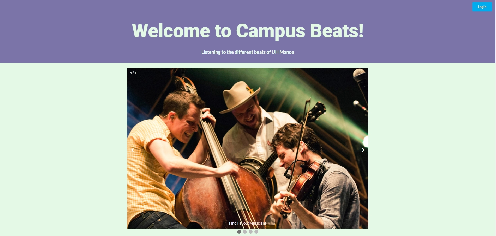

An authorized UH login is needed to enter Campus Beats. Click the "Login" button to access the application, however, the proper credentials need to be entered in the CAS authentication screen that appears up if you wish to use the application. The landing page also has a mobile carousel of music-related pictures that a user can look through before logging into the application. 

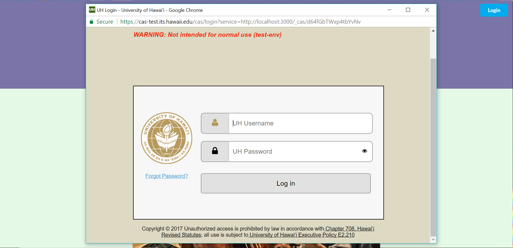

### Edit Profile
A new user will be taken to their Edit Profile page, where they can edit and add information to their profile, ranging from basic information like Name, Address, or Phone Number, to Campus Beats information li1ke their musical abilities and goals, or links to their external pages such as YouTube or SoundCloud.

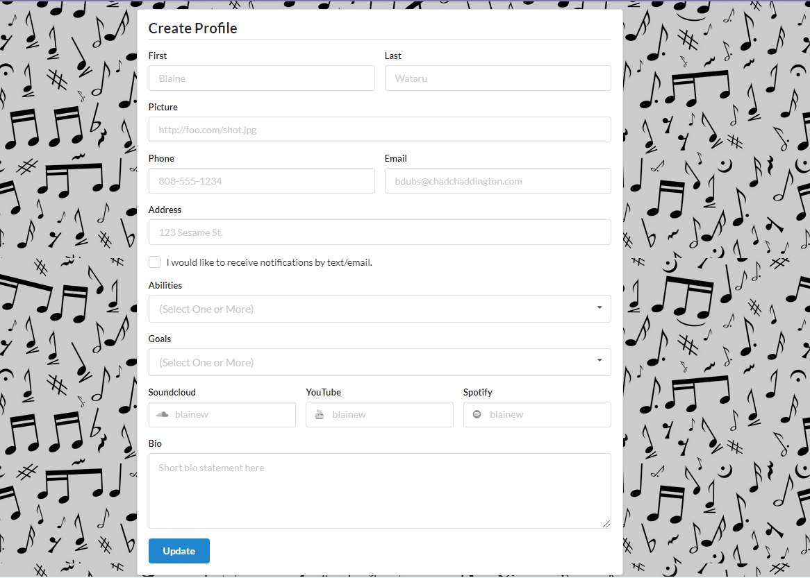

### Home Page
After the user has entered their information and saved it using the "Update" button, they can click on the "Home" tab in their menubar to go to the user homepage. From the homepage, the user can view their favorited users and any other users who have elected to contact them. 

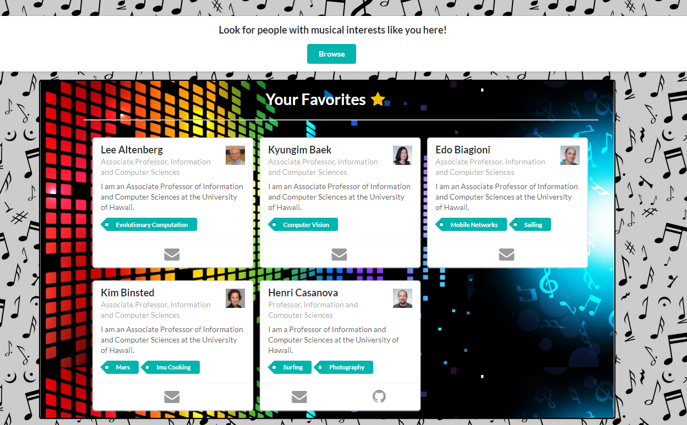
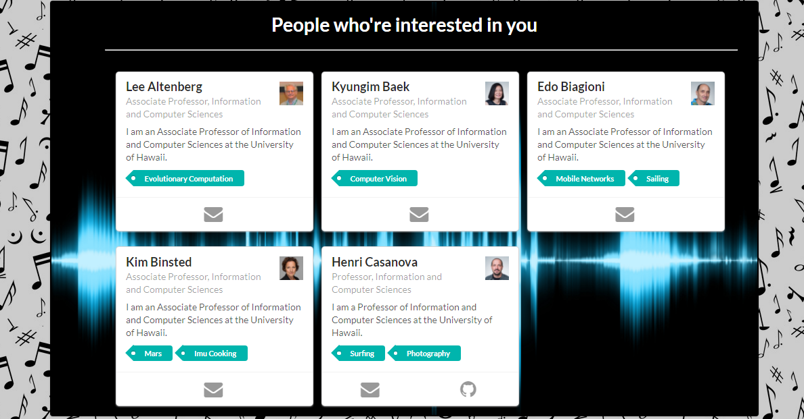

### Beats Page
The user can also choose to visit the "Beats" page. Here, they are presented with a filter (left side) and a directory (right side). The filter contains a multitude of search fields such as "Goals" or "Abilities" that will narrow down the directory based on what the user inputs in the filter. Once the directory is filtered, the user can click on the cards that show up to view a more in-depth profile page, favorite that person, which will add them to the user's "Favorites" in their homepage, or contact that person, which will show the user in that person's "Interested In You" section on their own homepage.

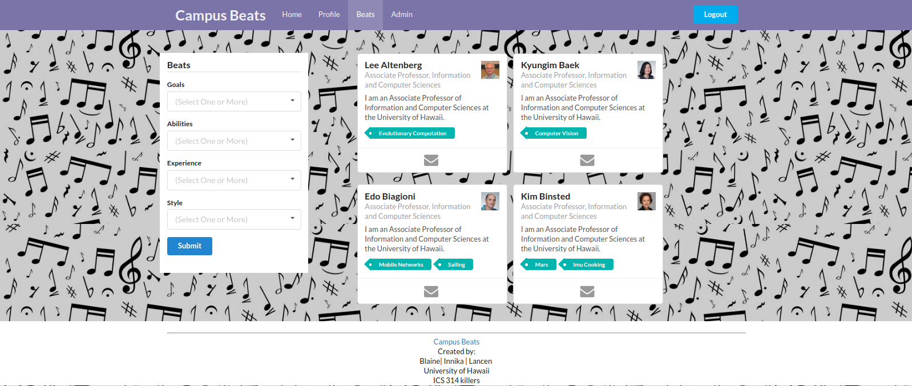

### Calendar Page

Lastly, the user can choose to visit the "Calendar" page where they will be presented with a calendar of events created by the userbase. Clicking on any day in the future (i.e. not a day before the current day, or the current day itself) will open the following popup:
(calendar page)

(create event popup)
Using this event popup, the user can create 

Admins go through the same process as the user, except they have special privileges. By going through the Admin Page they are able to go to the following pages:
 
 ### Monitor Page
 Admins are able to monitor the app by banning inappropriate users from the site by clicking the red ban buttons underneath the profiles. This allows the admin to remove the user from the application. However, removal is only able to remove the first profile listed at this time. This issue will be fixed in the future. Another implementation that needs to be added in the future is adding inappropriate users to a ban list. 
 
 ### Create Page
 They are also able to add new categories to Abilities, Styles, Experiences, and Goals dropdown menus. 

# Developer Guide to Campus Beats

## Installation
(1) Install [Meteor](https://www.meteor.com/install).

(2) Download a [zip file of Campus Beats](https://github.com/campusbeats/campusbeats/archive/master.zip) or clone it using git.
  
(3) Change into the app/ directory using the cd command and install Node libraries with:

```
$ meteor npm install
```
## Running the Application
(4) The application can be started using:

```
$ meteor npm run start
```

The application will appear at [http://localhost:3000](http://localhost:3000) when it is running correctly. You can login to the application if you have an account on the UH test CAS server.  

## Modifications FIX
If a fellow developer wishes to make alterations to this application, they can do so by:

(1) Get the application running on your local environment using the steps above.

(2) Changes to code can be made using any text editor or development environment such as [Atom](.

(3) 

# Application Design 

## Directory structure

At the top-level directory, the structure of CampusBeats looks similar to:

```
app/        # holds the Meteor application sources
config/     # holds configuration files, such as settings.development.json
.gitignore  # don't commit IntelliJ project files, node_modules, and settings.production.json
```

Within this structure, the configuration files and the Meteor application hosting CampusBeats are separated into two directories: the config/ directory and the app/ directory respectively. 

The top-level structure of the app/ directory looks like this:

```
client/
  lib/           # holds Semantic UI files.
  head.html      # the <head>
  main.js        # import all the client-side html and js files. 

imports/
  api/           # Define collection processing code (client + server side)
    ability/
    base/
    eventdata/
    experience/
    favorites/
    goal/
    interest/
    people-interested/
    profile/
    report/
    style/
  startup/       # Define code to run when system starts up (client-only, server-only)
    client/        
    server/        
  ui/
    components/  # templates that appear inside a page template.
    layouts/     # Layouts contain common elements to all pages (i.e. menubar and footer)
    pages/       # Pages are navigated to by FlowRouter routes.
    stylesheets/ # CSS customizations, if any.

node_modules/    # managed by Meteor

private/
  database/      # holds the JSON file used to initialize the database on startup.

public/          
  images/        # holds static images for landing page and predefined sample users.
  
server/
   main.js       # import all the server-side js files.
```

## Import conventions

Application code is located in the imports/ directory and the client/main.js and server/main.js that imports the appropriate code in the proper order for the client and server are in compliance with the Meteor 1.4 guidelines .

All imports/ subdirectory contains Javscript or HTML files that heach have top-level index.js files, which are responsble for importing the correct files to the current directory it is located in.    

Other directories are imported by the client/main.js and server/main.js. For instance, this is the contents of the client/main.js file of CampusBeats: 

```
import '/imports/startup/client';
import '/imports/ui/components/form-controls';
import '/imports/ui/components/directory';
import '/imports/ui/components/user';
import '/imports/ui/components/landing';
import '/imports/ui/layouts/directory';
import '/imports/ui/layouts/landing';
import '/imports/ui/layouts/shared';
import '/imports/ui/layouts/user';
import '/imports/ui/pages/directory';
import '/imports/ui/pages/filter';
import '/imports/ui/pages/beats';
import '/imports/ui/pages/home';
import '/imports/ui/pages/admin';
import '/imports/ui/pages/ban';
import '/imports/ui/pages/create';
import '/imports/ui/pages/monitor';
import '/imports/ui/pages/landing';
import '/imports/ui/pages/user';
import '/imports/ui/pages/calendar';
import '/imports/ui/stylesheets/style.css';
import '/imports/api/base';
import '/imports/api/profile';
import '/imports/api/interest';
import '/imports/api/ability';
import '/imports/api/style';
import '/imports/api/goal';
import '/imports/api/experience';
import '/imports/api/eventdata';
import '/imports/api/favorites';
import '/imports/api/people-interested';
import '/imports/api/report';
```

All of the directories import their specified index.js file, except for the style.css which is imported directly.

This approach is necessary in order to understand the order and type of code that is loaded in our application. It makes it easier to debug code or tempaltes that are not loaded, meaning they may not appear when the application is built. Ideally, top-level imports are located in two places: the main.js files in client/ and server/. Other index.js files are used to import subdirectories. 

Although the top-level import structure guarantees all of the necessary code and templates are loaded, it does not mean symbols are accessisble within a file. For instance, a symbol would need to be imported into a specific file if it is bounded to a collection. 
 
## Naming conventions

The naming conventions adhered for this application are:

  * Lowercase used for files and directories are named in all lowercase with hyphened words. E.g. accounts-config.js
  * Capitilazation used for"global" Javascript variables (such as collections). E.g. Interests.
  * Camel-case used for all other Javascript variables. E.g. collectionList.
  * Capitalization also used for pages represented by templates with underscores separating multiple words. E.g. Home_Page. Files within templates are lower lower case, with hyphens used to separate words. E.g. directory-page.html, user-home.js.
  * Route names are the same as their corresponding page, captilaization used with underscores separating words. E.g. Directory_Page.

## Data model

The CampusBeats data model is implemented by several Javascript classes: 
- [ProfileCollection](https://github.com/campusbeats/campusbeats/blob/master/app/imports/api/profile/ProfileCollection.js)
- [FavoritesCollection](https://github.com/campusbeats/campusbeats/blob/master/app/imports/api/favorites/FavoritesCollection.js)
- [PeopleInterestedCollection](https://github.com/campusbeats/campusbeats/blob/master/app/imports/api/people-interested/PeopleInterestedCollection.js)
- [ReportCollection](https://github.com/campusbeats/campusbeats/blob/master/app/imports/api/report/ReportCollection.js)
- [InterestCollection](https://github.com/campusbeats/campusbeats/blob/master/app/imports/api/interest/InterestCollection.js)
- [AbilityCollection](https://github.com/campusbeats/campusbeats/blob/master/app/imports/api/profile/ProfileCollection.js)
- [ExperienceCollection](https://github.com/campusbeats/campusbeats/blob/master/app/imports/api/experience/ExperienceCollection.js)
- [GoalCollection](https://github.com/campusbeats/campusbeats/blob/master/app/imports/api/goal/GoalCollection.js)
- [StyleCollection](https://github.com/campusbeats/campusbeats/blob/master/app/imports/api/style/StyleCollection.js)
- [EventData](https://github.com/campusbeats/campusbeats/blob/master/app/imports/api/eventdata/eventdata.js)

These classes encapsulate a MongoDB collection with the same name and export a single variable (e.g. Profiles) that provides access to that collection. 

Any part of the system that manipulates the CampusBeats data model imports one or many of these variables, and invokes methods of that class to get or set data.

Within the application, several collections using MongoDB (every class except EventData) are inherited from the [BaseCollection](https://github.com/campusbeats/campusbeats/blob/master/app/imports/api/base/BaseCollection.js) class.

The [BaseUtilities](https://github.com/campusbeats/campusbeats/blob/master/app/imports/api/base/BaseUtilities.js) file contains functions that operate across both classes. 

## CSS

The [Semantic UI](http://semantic-ui.com/) CSS framework is used within this application. To learn more about the Semantic UI theme integration with Meteor, see [Semantic-UI-Meteor](https://github.com/Semantic-Org/Semantic-UI-Meteor).

The [app/client/lib/semantic-ui](https://github.com/ics-software-engineering/meteor-application-template/tree/master/app/client/lib/semantic-ui) directory holds the Semantic UI theme files. To load, these files do need to be imported because they are located in the client/ directory and not the imports/ directory as Meteor automatically loads all files located in the client/ directory into the client. 

A menu is fixed at the top of all user pages, which means body elements will have padding and adjusted margins to make the page look visibly pleasing. The landing page, however, does not Note that the user pages contain a menu fixed to the top of the page, and thus the body element needs to have padding attached to it.  However, the landing page does not have a menu and does not need padding in the body. "Triggers" are needed in the [router](https://github.com/campusbeats/campusbeats/blob/master/app/imports/startup/client/router.js) to add and remove the appropriate classes from the body element upon visiting the page. 

## Routing

The application uses [Flow Router](https://github.com/kadirahq/flow-router) to display and navigate through the four main pages and additional pages. 

Routing used in this application is defined in [imports/startup/client/router.js](https://github.com/ics-software-engineering/meteor-application-template/blob/master/app/imports/startup/client/router.js).

The following routes are defined in CampusBeats:

  * The `/` route goes to the public landing page.
  * The `/directory` route goes to the public directory page.
  * The `/<user>/profile` route goes to the profile page associated with `<user>`, which is the UH account name.
  * The `/<user>/home` route goes to the home page associated with `<user>`, which is the UH account name.
  * The `/<user>/admin` route goes to the admin home page associated with `<user>`, which is the UH account name.
  * The `/<user>/beats` route goes to the beats page associated with `<user>`, which is the UH account name.
  * The `/<user>/calendar` route goes to the calendar page associated `<user>`, which is the UH account name.

## Authentication

In this application, the University of Hawaii CAS test server is used for authenticating users. The derived approach for authentication is shown in [meteor-example-uh-cas](http://ics-software-engineering.github.io/meteor-example-uh-cas/).

In order for the application to run successfully, it needs the CAS configuration information in a configuration file such as  [config/settings.development.json](https://github.com/ics-software-engineering/meteor-application-template/blob/master/config/settings.development.json). 

Those with a valid UH account can login and use CampusBeats to find musically inclined people. If a profile does not exist for the current user, one is created for them upon accessing the application. 

## Authorization 

Public pages are the landing and directory pages, thus, these pages can be accessed by anyone.

To use the profile and filter pages, authentication is required. The user must log in (i.e. be authenticated) through the UH test CAS server and the returned authenticated username within CAS must be an exact match to the username specified in the URL. For example, the authenticated user `bob` is the only user who can access his pages such as `http://localhost:3000/bob/profile`.

A template-based authorization following the recommendations in [Implementing Auth Logic and Permissions](https://kadira.io/academy/meteor-routing-guide/content/implementing-auth-logic-and-permissions) is used to restrict the contents of the application to authorized users only.  

An If_Authorized template, defined in [If_Authorized.html](https://github.com/campusbeats/campusbeats/blob/master/app/imports/ui/layouts/user/if-authorized.html) and [If_Authorized.js](https://github.com/campusbeats/campusbeats/blob/master/app/imports/ui/layouts/user/if-authorized.js) is implemented for the template-based authorization.

A seperate authorization for admin permissions will also be implemented at a future date. The admins will be allowed to see and access the special admin home page and controls.

## Configuration

The settings files are held in the [config](https://github.com/campusbeats/campusbeats/tree/master/config) directory.  There is one file in the directory, which is [config/settings.development.json](https://github.com/campusbeats/campusbeats/blob/master/config/settings.development.json).

To prevent a file named settings.production.json and other miscellaneous files from being committed to the repository, the [.gitignore](https://github.com/campusbeats/campusbeats/blob/master/.gitignore) was created. 

Upon startup, CampusBeats checks to see if the database is empty in [initialize-database.js](https://github.com/campusbeats/campusbeats/blob/master/app/imports/startup/server/initialize-database.js). If it is, the specified file from the configuration file, like [settings.development.json](https://github.com/campusbeats/campusbeats/blob/master/config/settings.development.json), is loaded.  A sample initialization for the databse is in [initial-collection-data.json](https://github.com/campusbeats/campusbeats/blob/master/app/private/database/initial-collection-data.json) for development purposes.

## Quality Assurance

### ESLint

A eslintrc file is included in Campusbeats to define the coding style that was followed in the development of this application. ESLint can be invoked from the command line as noted here:

```
meteor npm run lint
```

ESLint will generate some errors involving the following pages:
- [eventdata.js](https://github.com/campusbeats/campusbeats/blob/master/app/imports/api/eventdata/eventdata.js)
- [calendar-page.js](https://github.com/campusbeats/campusbeats/blob/master/app/imports/ui/calendar/calendar-page.js)
- [create-event-modal.js](https://github.com/campusbeats/campusbeats/blob/master/app/imports/ui/calendar/calendar-page.js)

These were created from [Chad Morita's Meteor-Calendar](http://www.chadmorita.com/meteor-example-fullcalendar/), using an old version of Meteor and ESLint, and were not able to be updated for ESMAScript 6.

# Development History

## Initial Mockup Pages
These pages are our initial ideas of what we wanted our application to have and our thought process of the functionalities behind the app. It allowed us to draw out our thoughts and created a basis for the initial design of our HTML pages. 

Landing page mockup page


Profile mockup page


Directory mockup page


## Milestone 1: Mockup Development
This milestone started on November 4, 2017 and ended on November 22, 2017. 

The task was to create four HTML mockup pages of CampusBeats and a complete implementation of the landing page, and to deploy our app to Galaxy. Other than the landing page, the four mockup pages consisted of the User Profile, User Home, Admin Home, and Search/Browse page (otherwise known as the Beats page). These mockup pages were created using the Meteor app using templates and FlowRouter to route specific pages.    

The following are the HTML mockups of our application:

### HTML Mockup for Landing:


### HTML Mockup for User Profile:


### HTML Mockup for User Home:


### HTML Mockup for Admin Home:


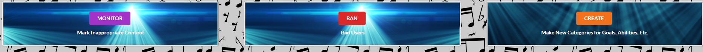


### HTML Mockup for Beats:


#### Milestone 1 was implemented as CampusBeats Github Milestone M1:
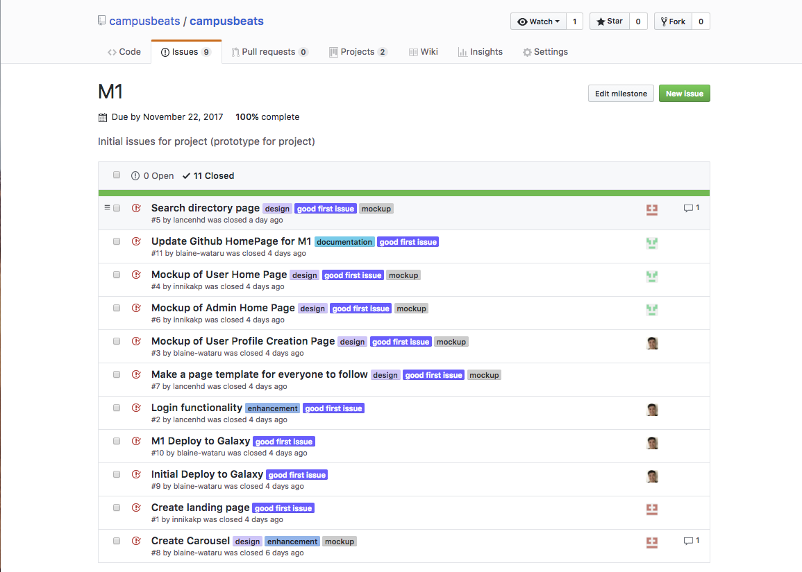  

#### The Project Page for Milestone 1 of CampusBeats can be found at [Milestone 1 Project Page](https://github.com/campusbeats/campusbeats/projects/1)

This is our timeline of Milestone 1.
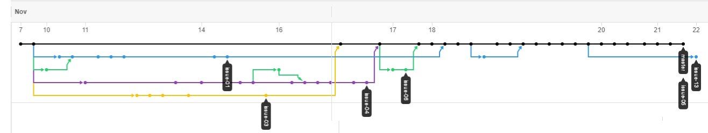

This illustrates the commits and various branches/merges created during the development of Milestone 1.

#### Milestone 1 consists of 9 issues, which are being managed using the CampusBeats GitHub Project M1:

Each issue was assigned to one person so that work can be delegated efficently to each team member. A branch named "issue" with its issue number was created for each issue. When every issue was finished/specific mockup page was completed, the branch was merged into master.
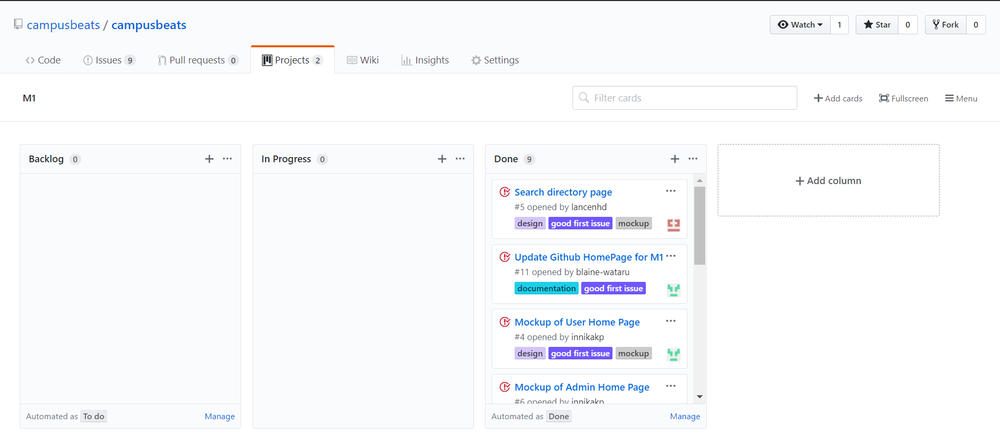

## Milestone 2 Functionality FIX
This milestone started on November 25, 2017 and ended on December 13, 2017. 

The task of Milestone 2 was to be able to implement the CAS authentication and improve multiple areas of our application, including quality, software egineering process, and most importantly functionality. Our goal was essentially to improve our application in any way possible, whether it was the funtionality or adding features to make the app more user friendly. Another goal we aimed for was to resolve unwanted behaviors in our funtionalities/features and ensure that every component of our application worked in sync with each other. 

The following features were implemented in Campus Beats during this milestone: 
 - A filter/search function in Beats. Profiles will be sorted based on categories, consisting of "Style", "Experience", "Abilities", and "Goals". In addition, the categories chosen during the creation of their profile will appear on the search page. This will enable them to start searching for other users who have similar interests as them.  
 - A favorite function that allows users to follow each other. User's favorites will also show up in their Home page under a Favorites section. Favorites will also show up in the Admin's home page.  
 - Allowing users to contact other users to jam with them. These users will show up in the People Interested section of the current user's Home page. Interested contacts will also show up in the Admin's home page.  
 - The ability for our profile page to collect data from the user and successfully create their profile, which will be sorted and filtered. User will also have the ability to update information in their profile.
 - The ability to create admin users who can monitor the application by banning "troublesome users" and creating new categories for future usage. These admin controls are located in the Admin home page where admins will be redirected to pages that fulfill these controls. The page to monitor the app consist of a dropdown that allows for the admin to select users who they feel have been inappropriate and proceed to ban them. The page to create new content allows the admin to input new categories in the Abilities, Styles, Goals, and Experiences section.   
 - A calendar that shows users when and where events would be held and the participants. The main usage of this feature is to schedule scheduling events and see which events are being held on a specific day, week, or month by clicking on a specific day on the calendar.   

In addition, the overall design of Campus Beats was also updated per essential feedback. To coincide with our choice of background/background color, changes were made to updated the overall color scheme of our application and changes therefter, such as changing the color of the menu bar to coincide with the background color. Now, the main, new colors of our application are a very dark teal and white. The color scheme was chosen with consideration of the background and other elements on various pages. 

The changes to specific pages include:
 - Landing: Color scheme of landing page reflects overall color scheme of Campus Beats. Footer also reflects main dark-teal color in heading.  
 - User home: Favorites and People Interested sections were updated to express a more modern theme. The backgrounds of these sections exhibit a gradient blue-dark teal palette while the title of each sectoin is encapsulated in a border to emphasize the title. The profile cards were kept the same color, white background, as it fit with the color scheme. Heading for browse, which routes to the Beats page, was also changed to reflect the design. The color of the footer was also changed to be an off-white to reflect this color scheme. 
 - Admin home: Design of Favorites and People Interested sections were updated to match the User home page. Additional design alterations were made for the admin controls. The color palette of said admin controls were adjusted to the overall theme of the Admin home page. The background color of each control was changed to be a lighter shade of blue and the buttons became an off-gray to reflect the blue text. The footer's color was also changed to be an off-white to reflect the color scheme. A "Monitor" page and a "Create" page were created to use the admin control features. The "Ban" button, however, was removed as it will be a functionality in the "Monitor" page instead. 

#### Milestone 2 has been implemented as CampusBeats Github Milestone M2:

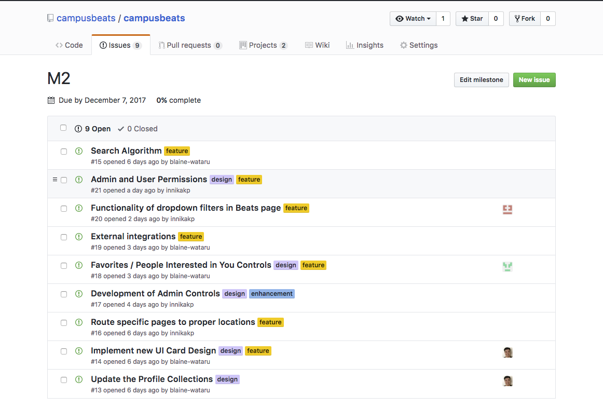

#### The Project Page for Milestone 2 of Campus Beats can be found at [Milestone 2 Project Page](https://github.com/campusbeats/campusbeats/projects/2)

Source code for Milestone 2 is in development.

#### Milestone 2 currently consists of 19 issues, which were managed using the CampusBeats GitHub Project M2:
Issues were created throughout the development process of Milestone 2. These ranged from updating the overall design of our application to implementing various funtionalities. Additionally, more pages were created to serve various purposes, such as the Calendar page. Although one person was assigned to be the main person working on that issue, many issues called for collaboration between members as the task appeared to be too big for one person to figure out, like the implemented search algorithm.  
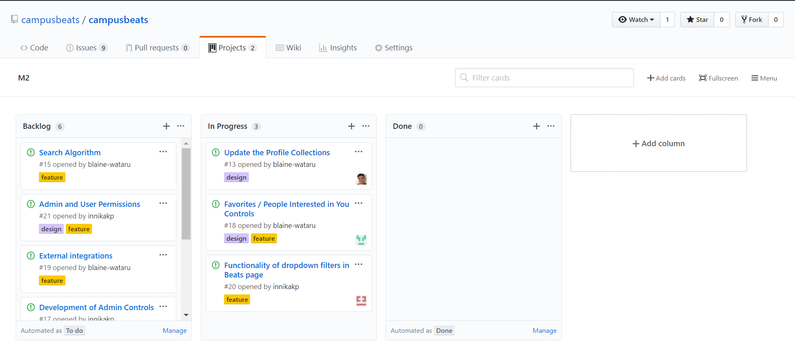
 
## Known bugs and issues FIX
These are a list of known bugs that, while not app-breaking, definitely exist. If you find a new bug, report it to the dev team!
  - Calendar Event Creator popup does not display all possible error messages
  - Unknown dependencies on InterestCollection pulled from Bowfolios
  - Information cannot be removed if input into profile

## Future Features and Design
These are the list of features/design aspects we hope to implement sometime in the future:
 - Implement admin & user permissions so that users will not be able to access admin features
 - Removal of banned profiles from the entire application, rather than from the monitor page alone
 - Integration with phone/text notifications
 - In-app messaging client
 - Mobile version

# Community Feedback FIX
After developing our application, we had 5 members of the community act as users to test our application. We received feedback from: Devan L., Jerrie S., Lindsay R., Ashley T., and Rie K.

The feedback we received from them are as follows:
## Liked
- "It looks and feels simple and easy to use" 
- "Maybe add colors to calendar's day of the week. So readability is easier." 
- Calendar automatically adjust sizes making it easy to see all events
- It looks like a real site/app.
- Great idea for people to meet each other and have fun.

# Could Improve
- Making the sentence before Browse button on User Home Page more concise
- Would be nice to be able to search using only some fields
- Select all / delete all for search options
- Some sort of tutorial would be helpful

# Contact us:
Developers of CampusBeats: Blaine Wataru, Innika Pang, and Lancen Daclison.

Email: watarub@hawaii.edu / innikakp@hawaii.edu / lancenhd@hawaii.edu
